# TaskFlow — GitOps et stratégies de release

[](https://github.com/Waddenn/taskflow-gitops/actions/workflows/validate.yml)

Travaux pratiques CI/CD M2, jour 2 — Sup de Vinci, module E54, Hardy Milalu Ngoma.
Équipe : **Tom PATELAS ([@Waddenn](https://github.com/Waddenn))** et
**Nicolas ROULOIS ([@Niccoco78](https://github.com/Niccoco78))**.
Exécution documentée le **7 octobre 2026**.

Ce dépôt est le fork de [taskflow-gitops de l’intervenant](https://github.com/9m7fjfpv9k-cyber/taskflow-gitops),
révision initiale `59403cb7768e3c65b78764bce7768faadbd9c9a7`.
**État applicatif final : Canary, TaskFlow 2.0.0, quatre pods prêts, Synced / Healthy.**

Il contient l’état Kubernetes de TaskFlow, les exercices réalisés par PR et les
preuves des déploiements. Le code applicatif et les images sont fournis par l’intervenant.

## Architecture et périmètre

```mermaid
flowchart LR
    Dev[Modification des manifests] --> PR[Pull Request]
    PR --> CI[CI : validation]
    CI --> Git[main : état souhaité]
    Git -->|pull périodique| Argo[Argo CD]
    Argo -->|sync / prune / selfHeal| K8s[Cluster kind-cicd]
    K8s --> Rollout[Argo Rollouts]
    Rollout --> Service[Service taskflow]
    Service --> Pods[Pods TaskFlow]
    K8s -. état observé .-> Argo
```



La CI valide les fichiers et ne possède aucun accès au cluster. Argo CD est dans
le cluster : il lit `main:apps/taskflow`, applique les écarts (`selfHeal`) et supprime
les ressources retirées de Git (`prune`). Le bootstrap d’Argo CD et de l’Application
est manuel ; les changements applicatifs suivants passent par Git.

Le ruleset de `main` impose une PR, le check `manifests`, une branche à jour et la
résolution des discussions ; il interdit la suppression de main et les force-push, sans bypass.
**Exécution des mesures par Tom ; aucune revue indépendante n’est revendiquée.**
[Niccoco78](https://github.com/Niccoco78) dispose de l’accès en écriture et a
complété l’équipe dans la [PR #10](https://github.com/Waddenn/taskflow-gitops/pull/10),
conservée dans ce compte rendu. Le seuil d’approbation reste
à 0 pour cette exécution ; le passer à 1 pour les prochaines PR relues en binôme.

## Prérequis et démarrage

Docker en fonctionnement, Bash, Git, accès HTTPS à GitHub/GHCR, au moins 8 Go de RAM
et 10 Go de disque disponibles. Sur Windows, utiliser WSL2 avec Docker intégré.

```bash
git clone https://github.com/Waddenn/taskflow-gitops.git
cd taskflow-gitops
mkdir -p .local
export KUBECONFIG="$PWD/.local/kubeconfig"
export PATH="$PWD/.local/bin:$HOME/.local/bin:$PATH"
./scripts/install.sh
source scripts/check-context.sh
kubectl apply -f argocd/application.yaml
kubectl -n argocd get application taskflow
kubectl -n taskflow get pods
./scripts/observe.sh taskflow 100
```

Le kubeconfig local est ignoré par Git. Ce choix préserve le contexte habituel du
poste (`k3d-classlab` pendant cette réalisation). Chaque nouveau terminal doit
reprendre les deux `export`. Ne pas exécuter les commandes de dérive sur un autre cluster.

- `./scripts/argocd-ui.sh` : interface Argo CD sur `https://localhost:8080` ;
  mot de passe initial affiché uniquement dans ce terminal.
- `kubectl argo rollouts get rollout taskflow -n taskflow --watch` : suivi du Rollout.
- `kubectl argo rollouts dashboard -n taskflow` : tableau de bord local sur le port 3100.
- `python3 scripts/snapshot.py` : état horodaté sans Secrets ni kubeconfig.
- [Rejouer les exercices étape par étape](docs/REPLAY.md).

`main` représente la **fin** du lab. Le cloner ne rejoue pas automatiquement son
historique. Les PR et leurs commits décrivent les états intermédiaires ; pour
refaire le matin, repartir du Deployment initial dans un autre fork de travail.

## Vérification des manifests

```bash
python3 -m venv .venv
. .venv/bin/activate
pip install PyYAML==6.0.3
python scripts/validate.py
for script in scripts/*.sh; do bash -n "$script"; done
```

Les contrôles vérifient notamment l’unicité du contrôleur, les quatre replicas, les
tags autorisés, les sélecteurs, les probes, les paliers et la politique Argo CD.
Ils ne prouvent pas que l’application répond correctement : les tests HTTP dans
le cluster complètent la CI. La version `2.1.0` reste volontairement autorisée pour
reproduire l’incident du cours.

Validation locale : manifests acceptés en `--dry-run=server`, lint Argo Rollouts
sans erreur, contrôles du contexte et des arguments vérifiés, puis
[réexécution complète de l’installateur](docs/evidence/install-verified.txt) réussie
sur le cluster existant. Les [résultats CI](docs/evidence/ci-runs.json) sont archivés
pour les PR du lab ; le badge en tête suit la CI actuelle.

## Journal des déploiements

Les horaires des preuves sont en UTC (`Z`) ; ajouter deux heures pour Paris le
7 octobre 2026. Les échantillons HTTP comptent des requêtes indépendantes depuis
un pod vers le Service. Aucun `port-forward` vers un pod n’est utilisé pour mesurer
le partage du trafic.

| Étape | Trace Git | Résultat constaté | Preuve |
|---|---|---|---|
| Initialisation | [#1](https://github.com/Waddenn/taskflow-gitops/pull/1) · `958ce928` | Deployment 1.0.0, 4 pods, Synced / Healthy. 100 version=1.0.0 http=200 | [état](docs/evidence/01-fork-baseline.json) |
| Release du matin | [#2](https://github.com/Waddenn/taskflow-gitops/pull/2) · `cc7bdcad` | Deployment 2.0.0, Synced / Healthy. 100 version=2.0.0 http=200 | [état](docs/evidence/02-deployment-2.0.0.json) |
| Revert du matin | [#3](https://github.com/Waddenn/taskflow-gitops/pull/3) · `4dff44c1` | Retour déclaratif à 1.0.0. 100 version=1.0.0 http=200 | [état](docs/evidence/04-revert-1.0.0.json) |
| Bonus prune | [#4](https://github.com/Waddenn/taskflow-gitops/pull/4) · `ea495183` | Service absent du cluster. 10 version=aucune http=000 | [état](docs/evidence/05-prune-service.json) |
| Restauration | [#5](https://github.com/Waddenn/taskflow-gitops/pull/5) · `102024e3` | Service recréé depuis Git. 100 version=1.0.0 http=200 | [état](docs/evidence/06-service-restored.json) |
| Blue-Green initial | [#6](https://github.com/Waddenn/taskflow-gitops/pull/6) · `4250e170` | Deployment supprimé ; Rollout 1.0.0, 4 pods. 100 version=1.0.0 http=200 | [état](docs/evidence/07-bluegreen-1.0.0.json) |
| Blue-Green 1.1.0 | [#7](https://github.com/Waddenn/taskflow-gitops/pull/7) · `d21e4a0a` | Pause avec 8 pods : production 1.0.0, preview 1.1.0. Promotion : 100 version=1.1.0 http=200 | [état](docs/evidence/08-bluegreen-promoted.json) |
| Migration Canary | [#8](https://github.com/Waddenn/taskflow-gitops/pull/8) · `f3e05ffd` | Même version stable 1.1.0 ; preview supprimée, Service sans hash Blue-Green. 100 version=1.1.0 http=200 | [état](docs/evidence/09-canary-1.1.0.json) |
| Canary 2.0.0 | [#9](https://github.com/Waddenn/taskflow-gitops/pull/9) · `4f524a80` | Paliers 25 / 50 / 75 / 100 % suivis ; arrivée à Healthy. 100 version=2.0.0 http=200 | [état](docs/evidence/10-canary-100.json) |
| Incident 2.1.0 | [#11](https://github.com/Waddenn/taskflow-gitops/pull/11) · `973675c8` | Erreurs métier à 25 %, malgré les probes vertes : 145 version=2.0.0 http=200; 37 version=2.1.0 http=200; 18 version=aucune http=500 | [état](docs/evidence/11-bug-paused.json) |
| Revert après abort | [#12](https://github.com/Waddenn/taskflow-gitops/pull/12) · `f3af0cd7` | Git revient à 2.0.0, Synced / Healthy. 200 version=2.0.0 http=200 | [état](docs/evidence/13-final-2.0.0.json) |

**Délai mesuré de la release 2.0.0 du matin : 61.1 s.** Fusion à
`2026-10-07T07:48:36Z`, détection de `Synced / Healthy` sur le SHA fusionné à
`2026-10-07T07:49:37.111903+00:00`. Sondage toutes les 2 s, précision limitée par ce pas de mesure et
l’arrondi de l’horodatage GitHub. Aucun refresh manuel n’a été demandé. Le réglage
60 s d’Argo CD n’est pas une promesse de délai exact : jitter, cache et démarrage
Kubernetes s’ajoutent. Voir les [événements horodatés](docs/evidence/events.jsonl).

**Dérives injectées sur la release du matin :** replicas abaissés de 4 à 1,
puis image remplacée par 1.1.0. Argo CD a rétabli la spec à 4 replicas / 2.0.0
au plus tard lors des premiers contrôles, environ 0,54 s et 0,40 s après les
commandes. Ce sont des bornes observées, pas des garanties de performance ;
la disponibilité complète des pods a été vérifiée séparément.

- Replicas : [dérive](docs/evidence/03-drift-replicas.json) → [correction](docs/evidence/03-healed-replicas.json).
- Image : [dérive](docs/evidence/03-drift-image.json) → [correction](docs/evidence/03-healed-image.json).
- Après les deux corrections : [100 réponses 2.0.0 / HTTP 200](docs/evidence/03-after-drift.txt).

### Blue-Green : deux versions prêtes, une seule en production


Avant promotion : [production 1.0.0](docs/evidence/08-bluegreen-production.txt)
et [preview 1.1.0](docs/evidence/08-bluegreen-preview.txt), chacune avec 100/100
réponses HTTP 200. Après promotion, la production sert 1.1.0 ; la réduction de
l’ancien ReplicaSet est vérifiée dans [cet état](docs/evidence/08-bluegreen-scaled-down.json).
Le délai de conservation configuré est de 30 s. La pause manuelle a été prolongée
pour réaliser la capture ; ce temps n’est pas compté comme un délai automatique.

### Canary : répartition réellement observée


Mesures : [25 %](docs/evidence/10-canary-25.txt), [50 %](docs/evidence/10-canary-50.txt),
[75 %](docs/evidence/10-canary-75.txt), [100 %](docs/evidence/10-canary-100.txt).
Le [suivi --watch](docs/evidence/10-canary-watch.txt) conserve le déroulement du Rollout.
Une seule promotion manuelle a levé la première pause ; les pauses de 60 s et de
30 s ont ensuite expiré normalement.

### Incident : abort rétablit le trafic, revert rétablit Git


Après `abort` : [état du Rollout et d’Argo CD](docs/evidence/12-aborted.json) et
[réponses HTTP](docs/evidence/12-aborted.txt). Les probes restent vertes pendant
l’incident : [mesure /health](docs/evidence/11-bug-health.txt). La PR de revert
termine le retour arrière en corrigeant la version voulue dans Git.

## Réponses aux questions du cours

### Push ou pull ?

C’est du **pull** : Argo CD récupère périodiquement Git depuis le cluster. Une PR
fusionnée change l’état souhaité ; le contrôleur le déploie ensuite. Dans un modèle
push, la CI appellerait directement l’API Kubernetes avec ses propres identifiants.
Le `kubectl apply` initial installe l’Application, il ne constitue pas le mécanisme
de livraison des versions suivantes.

### Qui a corrigé quoi ?

L’opérateur a créé les dérives avec `kubectl scale` et `kubectl set image`.
Argo CD a détecté les différences et rétabli les valeurs de Git grâce à `selfHeal`.
Le contrôleur Deployment de Kubernetes a ensuite ajusté les ReplicaSets et les pods.
Lors des stratégies progressives, Argo Rollouts orchestre les ReplicaSets, les pauses
et les sélecteurs des Services. Ces contrôleurs ont des rôles distincts.

### Pourquoi `git revert` ?

Un revert ajoute un commit qui annule le changement, sans réécrire l’historique.
Une PR permet de relire et de valider le retour arrière ; son SHA lie la décision
à l’état déployé. Une correction manuelle de la spec serait annulée par `selfHeal`.
Un `reset --hard` suivi d’un force-push détruirait la traçabilité et est interdit
par le ruleset. Ici les PR sont fusionnées en squash : `git revert <SHA-du-squash>`
est l’équivalent Git de la PR générée par le bouton Revert de GitHub.

### Après un `abort`, que montrent Rollout, Argo CD et Git ?

`abort` arrête la progression et fait revenir le trafic vers le ReplicaSet stable.
Il ne modifie pas le tag souhaité dans Git. Le Rollout peut donc rester dégradé,
avec une spec demandant `2.1.0`, tandis que les utilisateurs retrouvent `2.0.0`.
Argo CD peut afficher **Synced et Degraded simultanément** : la spec correspond à
Git, mais le déploiement demandé n’a pas abouti. Il faut ensuite une PR de revert
vers `2.0.0`, attendre sa réconciliation et vérifier à nouveau les codes HTTP.
Une promotion ou un abort est une action opérateur prévue par le cours, pas un
retour arrière déclaratif complet.

### Pourquoi des probes vertes avec des erreurs utilisateurs ?

Les probes interrogent `/health`. Si cette route répond 200 alors que `/` échoue,
Kubernetes conserve les pods Ready. Une sonde vérifie une condition technique, pas
l’ensemble du parcours utilisateur. Il faut mesurer les erreurs et latences sur les
routes métier, puis utiliser une analyse de rollout pour décider automatiquement
d’une promotion ou d’un abandon. Cette automatisation relève du jour 3 et n’est
pas présentée ici comme réalisée.

### Blue-Green ou Canary pour TaskFlow ?

Je retiens **Canary**, avec vérification du taux d’erreur métier avant promotion.
Le bug de `2.1.0` montre l’intérêt d’exposer d’abord une petite fraction du trafic
réel. Avec quatre replicas, les paliers correspondent approximativement à un,
deux puis trois pods de la nouvelle version ; le pourcentage de requêtes n’est
pas garanti, car aucun ingress/mesh ne pondère le trafic. Un traffic router et un
volume de requêtes suffisant seraient nécessaires pour une proportion contrôlée.

Blue-Green reste pertinent si la préproduction reproduit fidèlement les usages et
si une bascule globale avec retour rapide est prioritaire. Son coût atteint ici
huit pods pendant la transition (quatre bleus + quatre verts), contre quatre en
régime stable. Les 30 secondes de conservation des anciens pods facilitent un
retour rapide mais ne constituent pas un rollback automatique. Canary consomme
moins de capacité pendant les paliers, avec un surplus transitoire possible lors
du remplacement ; il expose néanmoins de vrais utilisateurs au défaut.

Aucune stratégie ne garantit le retour arrière d’une migration de données
incompatible. Le choix suppose également une application et des données compatibles
entre les deux versions.

## Corrections apportées au support et limites

- Argo Rollouts `v1.10.0` : application des CRD avec `--server-side`. L’application
  classique échouait avec `metadata.annotations: Too long` (limite de 262144 octets).
- Kubernetes et kubectl alignés sur `v1.37.0`, image kind fixée par digest.
- Observation : image curl versionnée, validation des paramètres, tolérance aux
  erreurs réseau et extraction de version compatible avec les espaces JSON.
- Les outils d’observation refusent un contexte différent de `kind-cicd`.
- Les pourcentages annoncés désignent les paliers, pas une garantie de routage.
- Les mesures sont celles d’un cluster local mono-nœud, pas un benchmark de production.
- Le bonus prune coupe volontairement le Service ; sa restauration est une PR distincte.

## Sources

- Support fourni : *CI/CD M2 — J2, GitOps et stratégies de release*, pages 9, 15 et 17.
- [Dépôt de l’intervenant](https://github.com/9m7fjfpv9k-cyber/taskflow-gitops).
- [Argo CD — synchronisation automatique, prune et selfHeal](https://argo-cd.readthedocs.io/en/stable/user-guide/auto_sync/).
- [Argo Rollouts — spécification Blue-Green et Canary](https://argo-rollouts.readthedocs.io/en/stable/features/specification/).
