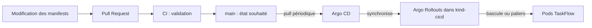
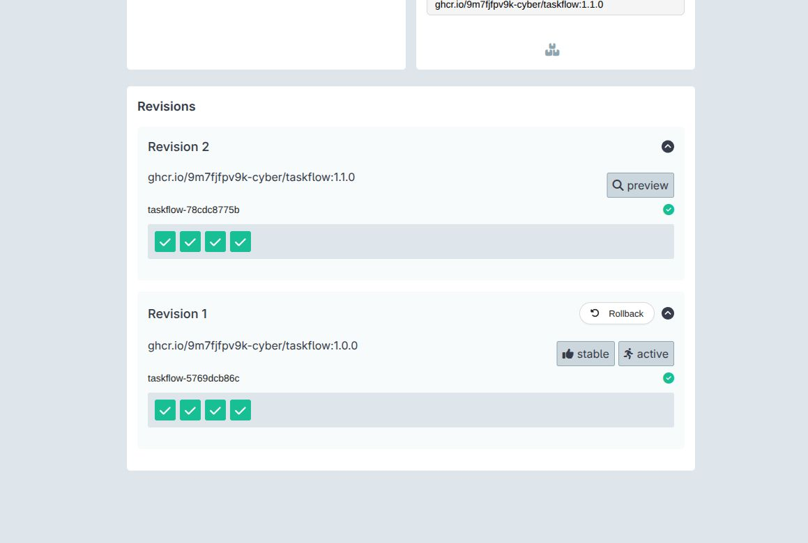
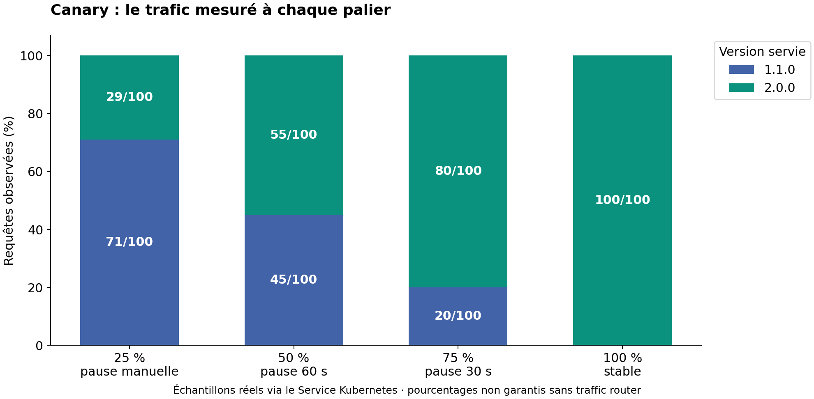
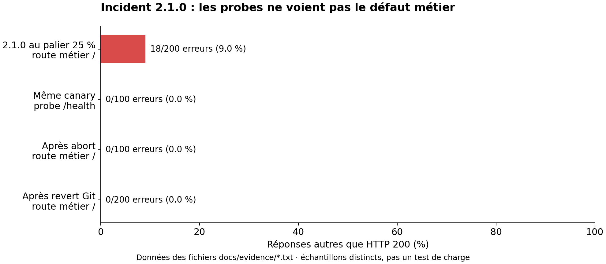
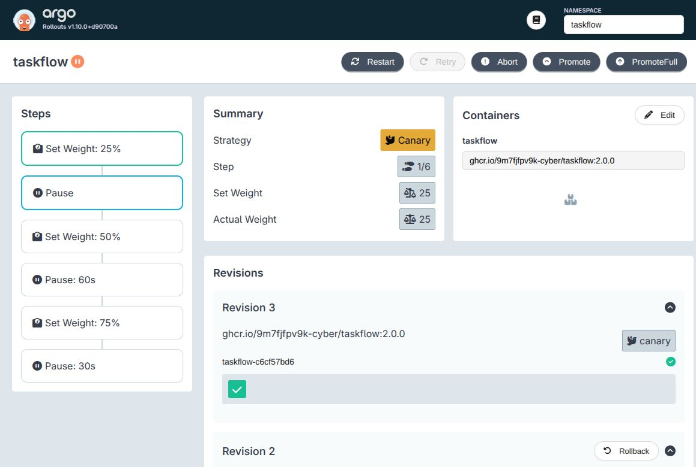
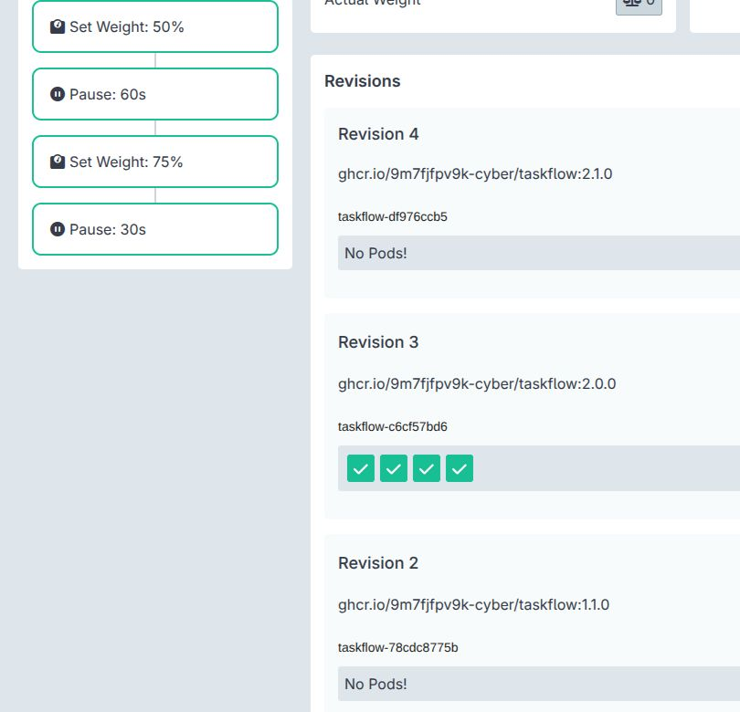

# TaskFlow — GitOps et stratégies de release

[](https://github.com/Waddenn/taskflow-gitops/actions/workflows/validate.yml)

TP CI/CD M2 — Sup de Vinci, cours de Hardy Milalu Ngoma, 7 octobre 2026.

**Équipe :** [Tom PATELAS](https://github.com/Waddenn) et [Nicolas ROULOIS](https://github.com/Niccoco78).
Dépôt basé sur [celui de l’intervenant](https://github.com/9m7fjfpv9k-cyber/taskflow-gitops).

**Objectif : déployer depuis Git, tester une release progressivement et revenir en arrière en cas de bug.**

| GitOps | Blue-Green | Retour après incident |
|---|---|---|
| Release déployée en **61 s** | **4 + 4 pods** : production et preview | **200/200 réponses HTTP 200** après revert |

**État final du J2 : TaskFlow 2.0.0, quatre pods prêts, Synced / Healthy** — configuration conforme à Git et application considérée saine par Argo CD.

**État actuel J3 : TaskFlow 2.2.0 à 100 %, quatre pods prêts, Synced / Healthy.**
La 2.1.0 a été annulée automatiquement après correction d’un faux positif du test k6.
Le rejeu mesure 27,71 % d’erreurs et un p95 de 308,43 ms ; la 2.2.0 passe avec
0 % d’erreurs et un p95 de 7,09 ms.

- [Partie A : étalon et analyse](docs/J3-partie-A.md)
- [Partie B : journal, mesures et captures](docs/J3-partie-B.md)
- [Postmortem 2.1.0 et correction du contrôle k6](docs/postmortem-2.1.0.md)
- [Partie C : mini-PSSI, tableau des contrôles et PR bloquée](docs/J3-partie-C.md)

Les deux checks PSSI sont obligatoires. La PR #29 est volontairement bloquée sur R3/R4.
Trivy détecte neuf vulnérabilités HIGH dans l’image du cours : dérogations individuelles
limitées au digest 2.2.0, jusqu’au 15 octobre 2026 ; elles ne sont pas corrigées.

## Fonctionnement



La CI vérifie les manifests. Argo CD lit `main`, déploie les changements et corrige
les dérives. Les modifications passent par PR, avec un check obligatoire sur `main`.
Le seuil d’approbation est à 0 pour cette réalisation.

## Journal du lab

Les [preuves](docs/evidence/) contiennent les états du cluster, les mesures HTTP et les horaires en UTC.

| Étape | PR | Résultat |
|---|---|---|
| Déploiement initial | [#1](https://github.com/Waddenn/taskflow-gitops/pull/1) | 1.0.0, quatre pods prêts |
| Release 2.0.0 | [#2](https://github.com/Waddenn/taskflow-gitops/pull/2) | Synced / Healthy en environ **61 s** après fusion |
| Dérives manuelles | — | Replicas réduits à 1 et image changée en 1.1.0 : Argo CD rétablit 4 replicas et 2.0.0 |
| Revert | [#3](https://github.com/Waddenn/taskflow-gitops/pull/3) | Retour à 1.0.0 |
| Bonus prune | [#4](https://github.com/Waddenn/taskflow-gitops/pull/4), [#5](https://github.com/Waddenn/taskflow-gitops/pull/5) | Service supprimé par Argo CD, puis restauré par PR |
| Blue-Green | [#6](https://github.com/Waddenn/taskflow-gitops/pull/6), [#7](https://github.com/Waddenn/taskflow-gitops/pull/7) | Preview 1.1.0 testée, puis promotion |
| Canary | [#8](https://github.com/Waddenn/taskflow-gitops/pull/8), [#9](https://github.com/Waddenn/taskflow-gitops/pull/9) | Passage de 1.1.0 à 2.0.0 par paliers |
| Incident 2.1.0 | [#11](https://github.com/Waddenn/taskflow-gitops/pull/11) | 18 erreurs HTTP 500 sur 200 requêtes, puis abort |
| Revert après abort | [#12](https://github.com/Waddenn/taskflow-gitops/pull/12) | Retour à 2.0.0 : **200/200 réponses HTTP 200** |

Le délai de 61 s a été mesuré sans refresh manuel, avec un contrôle toutes les 2 s.
Les [événements horodatés](docs/evidence/events.jsonl) permettent de retrouver les commits et les mesures.

### Blue-Green

Avant la promotion, quatre pods servent la version 1.0.0 et quatre autres exposent
la 1.1.0 sur le Service preview. Les deux Services répondent sans erreur sur 100 requêtes chacun.
Après la bascule, les anciens pods sont réduits avec un délai configuré de 30 s.



*Les deux versions coexistent : la preview permet de tester avant de basculer la production.*

### Canary

Une promotion manuelle débloque le palier 25 %, puis les pauses de 60 s à 50 % et de
30 s à 75 % s’enchaînent. Sans routeur de trafic, les pourcentages de requêtes restent approximatifs.



*Sur 100 requêtes par palier, la nouvelle version reçoit 29, 55, 80 puis 100 réponses : la progression est visible, sans routage au pourcentage exact.*

### Incident et retour arrière

Avec 2.1.0, la route `/` renvoie des erreurs alors que `/health` répond toujours 200.
Après `abort`, les requêtes repassent sur 2.0.0. Git demande encore 2.1.0 : la PR de revert termine le retour arrière.



*Le bug affecte la route métier, pas `/health`. L’abort rétablit le trafic ; le revert rétablit aussi la version déclarée dans Git.*

<details>
<summary>Captures complémentaires : Canary en pause et après abort</summary>



*Un pod sur quatre porte la nouvelle version avant la promotion manuelle.*



*Après abort, les quatre pods stables servent le trafic, mais la version demandée reste 2.1.0 jusqu’au revert.*

</details>

## Réponses aux questions

**Push ou pull ?** Pull : Argo CD récupère Git depuis le cluster. La CI ne déploie pas directement.

**Qui corrige les dérives ?** Argo CD rétablit la configuration de Git grâce à `selfHeal`.
Kubernetes ajuste ensuite les pods. Argo Rollouts gère les paliers et les bascules.

**Pourquoi `git revert` ?** Il annule le changement avec un nouveau commit et conserve l’historique.
Une correction manuelle du cluster serait annulée par Argo CD.

**Après un abort ?** Le trafic revient sur la version stable, mais Git conserve le tag défectueux.
Nous avons observé **Synced / Degraded** : la configuration correspond à Git, mais la release a échoué.
Il faut une PR de revert pour retrouver **Synced / Healthy**.

**Pourquoi les probes restent vertes ?** Elles testent `/health`, pas la route métier qui échoue.
Il faut aussi surveiller les erreurs et les latences réellement rencontrées par les utilisateurs.

**Blue-Green ou Canary pour TaskFlow ?** Canary permet de limiter l’exposition à un bug comme celui de
2.1.0, avec moins de pods qu’un Blue-Green complet. En contrepartie, une partie des utilisateurs subit
le défaut. Blue-Green facilite une bascule rapide, mais nécessite ici huit pods pendant la transition
et expose tout le trafic après promotion. Pour TaskFlow, nous retenons Canary avec contrôle des erreurs avant promotion.

<details>
<summary><strong>Reproduire le lab et lancer les contrôles</strong></summary>

## Lancer le projet

Prérequis : Docker démarré, Bash, Git, 8 Go de RAM et 10 Go libres. Sous Windows, utiliser WSL2.

```bash
git clone https://github.com/Waddenn/taskflow-gitops.git
cd taskflow-gitops
mkdir -p .local
export KUBECONFIG="$PWD/.local/kubeconfig"
export PATH="$PWD/.local/bin:$HOME/.local/bin:$PATH"
./scripts/install.sh
source scripts/check-context.sh
kubectl apply -f argocd/application.yaml
kubectl -n argocd get application taskflow
./scripts/observe.sh taskflow 100
```

Reprendre les deux `export` dans chaque nouveau terminal. Le contexte du lab doit être `kind-cicd`.
La branche `main` contient l’état final ; voir le [guide pour rejouer les exercices](docs/REPLAY.md).

- Interface Argo CD : `./scripts/argocd-ui.sh`
- Suivi : `kubectl argo rollouts get rollout taskflow -n taskflow --watch`
- Dashboard : `kubectl argo rollouts dashboard -n taskflow`

## Validation et ajustements

La CI vérifie les manifests et les scripts. Les manifests ont aussi été validés par Kubernetes,
et l’installateur a été [relancé avec succès](docs/evidence/install-verified.txt).

Pour lancer les contrôles en local :

```bash
python3 -m venv .venv
. .venv/bin/activate
pip install PyYAML==6.0.3
python scripts/validate.py
for script in scripts/*.sh; do bash -n "$script"; done
```

L’installation d’Argo Rollouts a nécessité `--server-side` pour éviter la limite de taille des annotations.
Kubernetes et kubectl sont fixés en 1.37.0. Le script d’observation vérifie le contexte et les paramètres.
Les captures viennent du cluster local ; les graphiques sont [régénérables à partir des mesures](docs/images/README.md).

</details>

## Références

- Support *CI/CD M2 — J2, GitOps et stratégies de release*, pages 9, 15 et 17.
- [Argo CD : synchronisation automatique](https://argo-cd.readthedocs.io/en/stable/user-guide/auto_sync/)
- [Argo Rollouts : Blue-Green et Canary](https://argo-rollouts.readthedocs.io/en/stable/features/specification/)
