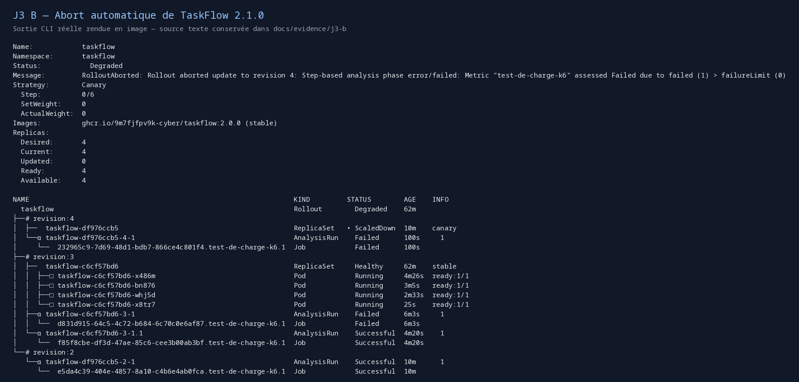
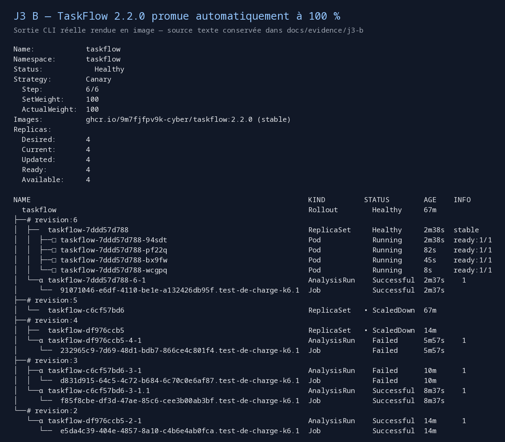

# J3 — Partie B : incident, abort automatique et version corrigée

**Terminé le 8 octobre 2026 : TaskFlow 2.2.0 à 100 %, quatre pods prêts,
Argo CD Synced / Healthy.** La [partie C est documentée séparément](J3-partie-C.md).

La partie B reprend la configuration de la partie A et la modification du scénario
à **60 secondes** fusionnée dans la PR #20. Aucun abort ni aucune promotion manuelle
n’a été exécuté. Les changements d’images, corrections et reverts passent par PR et CI.
Un refresh Argo CD a été demandé au démarrage de certains déploiements ; les analyses
et décisions suivantes sont celles du contrôleur.

## Résultats mesurés

| Essai | Analyse | Requêtes HTTP | Erreurs | p95 | Décision |
| --- | --- | --- | --- | --- | --- |
| Premier 2.1.0, avant correction | `taskflow-df976ccb5-2-1` | 1 470 | 0 % | 4,70 ms | Faux positif : la stable était testée, 2.1.0 a été promue |
| Retour 2.0.0 avec cible corrigée | `taskflow-c6cf57bd6-3-1.1` | 1 454 | 0 % | 8,29 ms | Successful, référence rétablie |
| Rejeu 2.1.0 | `taskflow-df976ccb5-4-1` | 599 | **27,71 %** | **308,43 ms** | **Failed → abort automatique** |
| Version corrigée 2.2.0 | `taskflow-7ddd57d788-6-1` | 1 465 | **0 %** | **7,09 ms** | **Successful → 100 %** |

Les requêtes HTTP des essais corrigés comprennent quelques appels `/health` de préparation.
La charge métier elle-même dure 60 secondes avec 5 VU. Pour le rejeu 2.1.0,
166 des 595 requêtes `/tasks` ont échoué ; pour 2.2.0, les 1 462 requêtes métier réussissent.

Le premier essai n’a pas démontré un abort. Les logs ont révélé que les connexions du test
atteignaient encore un pod stable. La correction vérifie le hash cible avant la charge et
empêche la réutilisation des connexions. Le [postmortem](postmortem-2.1.0.md) décrit
ce défaut, le premier retour lui aussi mal mesuré, la correction et le rejeu probant.

## Journal des PR

| PR | Objet | Résultat |
| --- | --- | --- |
| [#21](https://github.com/Waddenn/taskflow-gitops/pull/21) | Première image 2.1.0 | Faux positif k6 conservé dans les preuves |
| [#22](https://github.com/Waddenn/taskflow-gitops/pull/22) | Premier revert vers 2.0.0 | Test affecté par l’ancienne cible |
| [#23](https://github.com/Waddenn/taskflow-gitops/pull/23) | Correction de la cible et tests en CI | Référence 2.0.0 rétablie automatiquement |
| [#24](https://github.com/Waddenn/taskflow-gitops/pull/24) | Rejeu image 2.1.0 | Abort automatique au palier 25 % |
| [#25](https://github.com/Waddenn/taskflow-gitops/pull/25) | Revert après abort | Git et cluster alignés sur 2.0.0 |
| [#26](https://github.com/Waddenn/taskflow-gitops/pull/26) | Image 2.2.0 | Analyse Successful, promotion automatique complète |

Tous les checks `manifests` requis de ces PR sont passés avant fusion. Le correctif
ajoute également les tests de convergence `node tests/test_k6_setup.mjs` à la CI.
Les deux autres PR correctives J2 déjà ouvertes (#16 et #17) restent indépendantes.

## Quatre preuves et captures

- [Révision 4 et abort du Rollout](evidence/j3-b/rollout-abort-stabilise.txt).
- [AnalysisRun 2.1.0 Failed](evidence/j3-b/taskflow-df976ccb5-4-1-describe.txt).
- [Logs k6 en échec](evidence/j3-b/232965c9-7d69-48d1-bdb7-866ce4c801f4.test-de-charge-k6.1-logs.txt).
- [Événements Kubernetes de l’abort](evidence/j3-b/events-abort-stabilise.json).





Ces images sont des rendus fidèles des sorties CLI enregistrées, pas des captures de bureau.
Les [sources de l’état final](evidence/j3-b/rollout-succes-2.2.0.txt),
[l’AnalysisRun réussi](evidence/j3-b/taskflow-7ddd57d788-6-1-describe.txt)
et les [logs k6 2.2.0](evidence/j3-b/91071046-e6df-4110-be1e-a132426db95f.test-de-charge-k6.1-logs.txt)
sont conservés.

## Progression finale et contrôles

Heures de Paris, le 8 octobre :

| Heure | État de 2.2.0 |
| --- | --- |
| 11:10:04 | Fusion de la PR #26 |
| 11:10:11 | 25 %, un pod canary, analyse en cours |
| 11:11:25 | Analyse réussie, passage au palier suivant |
| 11:11:32 | 50 %, deux pods 2.2.0 prêts |
| 11:12:11 | 75 %, trois pods 2.2.0 prêts |
| 11:12:43 | 100 %, quatre pods prêts, Healthy |
| 11:12:49 et 11:12:54 | Vérifications HTTP finales |

Les mesures viennent de la [chronologie compacte](evidence/j3-b/timeline-compact.jsonl),
observée toutes les ≈2,3 secondes. Les événements et timestamps natifs sont également archivés.

Les [200 requêtes `/health`](evidence/j3-b/http-final-2.2.0.txt) répondent toutes en **2.2.0**,
et les [200 requêtes `/tasks`](evidence/j3-b/tasks-final-2.2.0.txt) répondent toutes **HTTP 200**.
Le [snapshot final](evidence/j3-b/etat-succes-2.2.0.json) confirme Synced / Healthy.
Les paramètres lus dans [l’image 2.2.0](evidence/j3-b/cause-2.2.0.txt) sont `FAILURE_RATE=0` et `LATENCY_MS=0`.

Les pods de Jobs k6 en état Error sont conservés comme preuves des tests échoués ;
les quatre pods applicatifs TaskFlow sont sains.

## Refaire les contrôles

```bash
export KUBECONFIG="$PWD/.local/kubeconfig"
export PATH="$PWD/.local/bin:$HOME/.local/bin:$PATH"
python3 scripts/validate.py
node tests/test_k6_setup.mjs
kubectl argo rollouts get rollout taskflow -n taskflow
kubectl -n taskflow get analysisrun
kubectl -n argocd get application taskflow
```

La PSSI a ensuite été ajoutée dans la [partie C](J3-partie-C.md) ; les mesures ci-dessus restent celles de la partie B.
