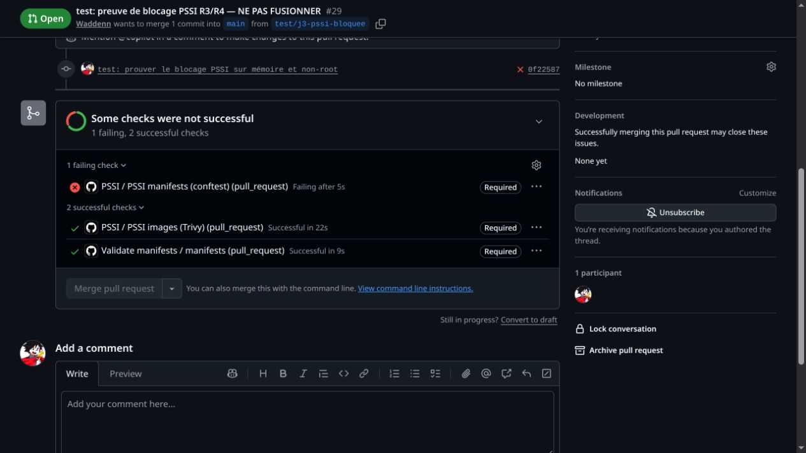

# J3 — Partie C : mini-PSSI en contrôles bloquants

**Lab C terminé le 8 octobre 2026.** Les règles R1 à R4 sont contrôlées par conftest,
R5 par Trivy. Les deux checks PSSI sont obligatoires dans le ruleset de `main`.
La [PR #29 volontairement non conforme](https://github.com/Waddenn/taskflow-gitops/pull/29)
est **ouverte et bloquée**, sans déploiement de sa branche.

**Limite importante : neuf vulnérabilités HIGH restent présentes dans l’image pédagogique.**
Elles font l’objet d’exceptions individuelles expirant le **15 octobre 2026**, limitées au
digest 2.2.0 documenté. Elles ne sont pas corrigées par ce lab.

## Tableau règle → contrôle → outil → preuve

| Règle | Contrôle réalisé | Outil | Preuve |
| --- | --- | --- | --- |
| R1 — tag explicite, jamais latest | Refus des tags absents et de `latest`, y compris avec un digest ajouté | conftest / Rego | [Règles](../policies/kubernetes.rego), [tests tag absent et latest](../policies/kubernetes_test.rego), [11 tests réussis](evidence/j3-c/tests-rego.txt) |
| R2 — registre autorisé | Préfixe exact `ghcr.io/9m7fjfpv9k-cyber/` | conftest / Rego | Test de refus de `nginx:1.27` et initContainer `nginx:latest` dans les [tests Rego](../policies/kubernetes_test.rego) |
| R3 — limite mémoire | Refus d’un conteneur sans `resources.limits.memory` ; initContainers inclus | conftest / Rego | [Check GitHub rouge R3/R4](evidence/j3-c/ci-pssi-rouge.txt) sur la PR #29 |
| R4 — pod non-root | `securityContext.runAsNonRoot: true`, refus d’overrides false et d’UID 0 explicite | conftest / Kubernetes | [Échec avant correction](evidence/j3-c/conftest-avant-r4.txt), [succès après](evidence/j3-c/conftest-apres-r4.txt), [UID réel 10001](evidence/j3-c/identite-runtime.txt), [contrainte déployée](evidence/j3-c/security-context-final.json) |
| R5 — aucune HIGH/CRITICAL corrigeable sans exception | Scan des images de production, blocage hors dérogations explicites et non expirées | Trivy 0.75.0 | [Rapport brut : 9 HIGH, 0 CRITICAL](evidence/j3-c/trivy-brut.json), [rapport avec résultats sous dérogation](evidence/j3-c/trivy-avec-exceptions.json), [expiration testée](evidence/j3-c/test-expiration.txt) |

## Intégration et protection de main

La [PR #28](https://github.com/Waddenn/taskflow-gitops/pull/28) installe le workflow
[pssi.yml](../.github/workflows/pssi.yml), complète les règles R3/R4 et active la contrainte
non-root du Rollout. Elle documente et valide les dérogations R5 dans le cadre du lab.
Les trois checks ont réussi avant fusion : [résultat GitHub archivé](evidence/j3-c/pr-integration.json).

Le ruleset conserve ses protections existantes et exige maintenant :

- `manifests` ;
- `PSSI manifests (conftest)` ;
- `PSSI images (Trivy)`.

Il est actif, sans acteur de contournement, avec checks stricts.
Le nombre d’approbations humaines requis reste à 0 comme dans le lab existant :
aucune revue indépendante n’est revendiquée. [Ruleset réellement configuré](evidence/j3-c/ruleset-pssi.json).

Conftest est fixé en 0.71.1, avec SHA-256 de l’archive vérifié.
Trivy est fixé en 0.75.0 avec digest. Les actions sont également fixées par SHA.
Les rapports Trivy sont conservés dans l’artifact GitHub `pssi-trivy`, y compris en échec.
Le scanner reçoit uniquement ses rapports et son cache, pas le kubeconfig du dépôt.

## PR non conforme et capture du blocage

La PR #29 retire la limite mémoire et met `runAsNonRoot: false`.
Elle conserve une image et une structure acceptées par l’ancien validateur afin
d’isoler l’effet du nouveau contrôle PSSI.

| Check | Résultat observé |
| --- | --- |
| `manifests` historique | SUCCESS |
| `PSSI images (Trivy)` | SUCCESS, avec les dérogations R5 documentées |
| `PSSI manifests (conftest)` | **FAILURE : R3 et R4** |
| État de fusion GitHub | **BLOCKED** |

[État retourné par GitHub](evidence/j3-c/pr-bloquee.json) et
[sortie locale correspondante](evidence/j3-c/pr-negative-conftest.txt).
Les cas `latest` et registre interdit sont également refusés par les tests Rego ;
la PR de preuve utilise R3/R4 pour que le contrôle historique reste vert.



*Capture réelle de GitHub : un check obligatoire échoue, deux réussissent,
et le bouton Merge pull request est désactivé. La PR est conservée ouverte comme preuve.*

Aucune tentative de fusion n’est nécessaire : l’API indique BLOCKED et l’interface
désactive la fusion. La branche non conforme n’a pas été déployée ; Argo CD suit `main`.

## Dérogations Trivy : portée et expiration

L’image 2.2.0 contient des versions vulnérables de **Starlette 0.41.3** et **urllib3 1.26.20**.
Les [neuf CVE, versions corrigées et justification](../policies/exceptions.md) sont listées
individuellement. L’image appartient au registre imposé par l’intervenant ; le lab conserve
cette référence. Le risque est accepté temporairement dans ce contexte local,
sans affirmation de non-exploitabilité ni validation pour une production réelle.

Le fichier [.trivyignore](../.trivyignore) contient une date `exp:2026-10-15` pour chaque CVE.
Le [script de scan](../scripts/pssi-images.py) :

1. découvre les images de tous les workloads de production couverts ;
2. refuse une liste vide et conserve un scan brut sans exception ;
3. applique les exceptions uniquement au digest autorisé, puis scanne cette référence immuable ;
4. conserve aussi les résultats supprimés et échoue sur toute autre HIGH/CRITICAL corrigeable.

Le test avec une date volontairement expirée ressort **code 1 et neuf vulnérabilités**.
Le check vert actuel signifie donc « conforme avec neuf dérogations actives »,
pas « image sans vulnérabilités ».

Avant le 15 octobre : obtenir une image corrigée dans le registre autorisé, vérifier
la compatibilité des dépendances, supprimer les exceptions et refaire le scan.
Aucun rappel ni renouvellement automatique n’a été créé.

## État final et périmètre

TaskFlow reste en **2.2.0**, avec **quatre pods prêts** et Argo CD **Synced / Healthy**.
Le pod déclare `runAsNonRoot: true`, le processus tourne avec l’UID **10001** et
chaque conteneur applicatif garde sa limite **256Mi**.
[Snapshot final](evidence/j3-c/etat-final.json).

R1 à R4 couvrent les Deployment, Rollout, StatefulSet et DaemonSet dans `apps/`,
y compris leurs initContainers. R5 couvre leurs images. Les Jobs k6 de l’AnalysisTemplate,
les composants Argo et les images du cluster sont hors de ce périmètre, comme dans la
politique du support. Ce contrôle CI n’est pas une politique d’admission Kubernetes.

Ce rendu couvre le **Lab C**. L’exercice distinct SAST / DAST / IAST et la mini-soutenance
ne sont pas réalisés ici.

## Reproduire

```bash
conftest verify --policy policies/
conftest test apps/ --policy policies/
python3 scripts/pssi-images.py
gh pr checks 29 --repo Waddenn/taskflow-gitops
gh pr view 29 --repo Waddenn/taskflow-gitops --json mergeStateStatus
```

L’échec des checks de la PR #29 est volontaire. Le même contrôle réussit sur `main`,
sous réserve de nouvelles vulnérabilités publiées et de l’expiration des dérogations.
